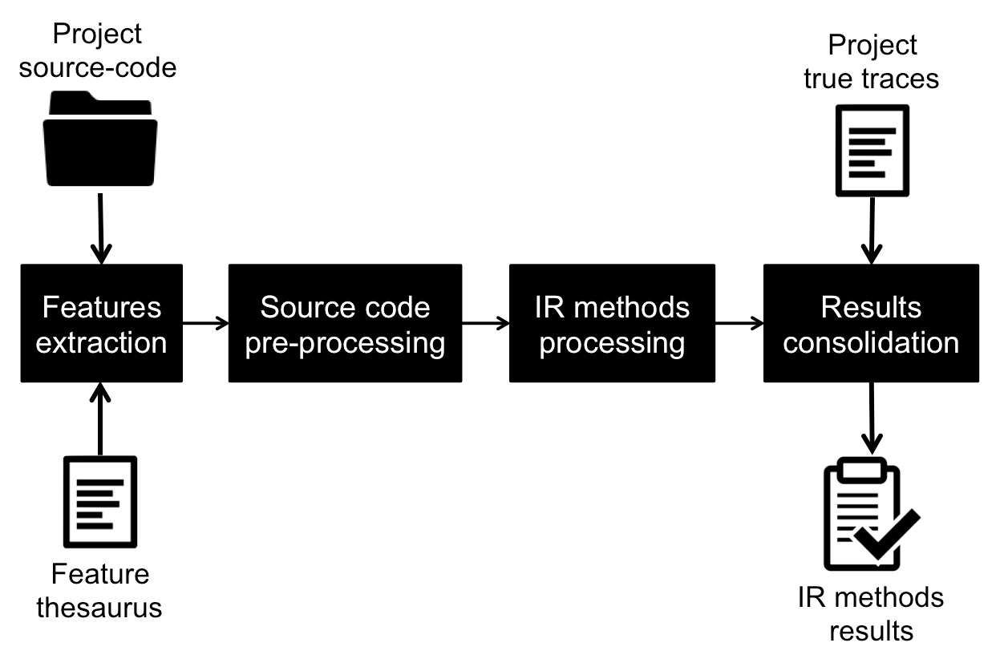

# SPLTrac - SPL Traceability Experimental Suite

## About
SPLTrac is a SPL Traceability Experimental Suite written in Python that applies well-known information retrieval methods ([classic vector model](https://en.wikipedia.org/wiki/Vector_space_model), [latent semantic indexing](https://en.wikipedia.org/wiki/Latent_semantic_analysis), [neural networks](http://dl.acm.org/citation.cfm?doid=122860.122880), [extended boolean model](https://en.wikipedia.org/wiki/Extended_Boolean_model), and [BM25](https://en.wikipedia.org/wiki/Okapi_BM25)) into the recovery of SPL features from the projects source code.



### Features extraction
The first step of the experiment is to obtain the SPL project features to establish the traces. In this sense, SPLTrac is able to extract features from different variability implementation technologies and proceed with the application of IR methods. It also collects the thesaurus for the project, that contains synonyms of features used for information retrieval.

### Source code pre-processing
After getting features and synonyms, the pre-processing module extracts the valid source code files, and collects its terms, term frequencies and source code file names. All information is used to support the IR algorithms.

### IR methods processing
SPLTrac runs the implement IR methods (classic vector, latent semantic indexing, extended boolean, neural networks and BM25), extracting feature-to-code traces that will be analyzed later to check retrieval quality of the method. Currently, there are five implemented algorithms. However, it can be easily extended to incorporate more proposals and get advantage of the feature extraction, pre-processing and retrieval evaluation features provided by SPLTrac.

### Results consolidation
This module measures the IR methods according to their [precision, recall, F-measure (aka F1 measure)](https://en.wikipedia.org/wiki/Evaluation_measures_(information_retrieval)) and performance (in terms of processing time). Then, it generates six scripts that can be executed in the [R statistical computing](https://www.r-project.org/) tool to obtain statistical analysis results and charts related to each method.

## Project structure

* `evaluation`: provides classes and functions related to the evaluation of the IR methods results, which calculates the precision, recall, F-measure and performance metrics;
* `experiment`: contains the main.py class to start the SPLTrac process, calling the available IR methods for the existing projects;
* `features_extraction`: recovers the features for each project according to the variability implementation technology (FeatureHouse, CIDE, AHEAD, Antenna, and HyperJ);
* `files`: configuration files to support the IR methods and the standard procedures of the SPLTrac suite;
* `information_retrieval_methods`: this package has the implemented IR algorithms (classic vector, latent semantic indexing, neural networks, extended boolean, and BM25); and
* `product_line_projects`: source code for the SPL projects from [SPL2Go](http://spl2go.cs.ovgu.de/).
* `preprocessor_projects`: source code for highly-configurable system projects from [Freecode.com](http://freecode.com/).

## How to use

### Run SPLTrac

To execute the SPLTrac suite, just locate the `experiment` folder in the terminal, and run the following command:

Option 1:
```
1) Open the PyCharm Community Edition;
2) Import the spltrac project;
3) Run the main file (experiment folder -> main.py);
```

Option 2:
```
1) Make sure you have installed Python 3.
2) Install the python dependencies through pip:
- pip install scipy
- pip install nltk
3) Run the main file (experiment folder):
python3 main.py
```

This project was developed using [PyCharm Community Edition 2017.1.2](https://www.jetbrains.com/pycharm/) running under the [Python 2.7.10](https://www.python.org/) version.

### Run statistical scripts

Download and install the R tool ([https://www.r-project.org/](https://www.r-project.org/)) to run all generated scripts in the `experiment/results` folder. More information about running R scripts can be found at [http://www.cookbook-r.com/Data_input_and_output/Running_a_script/](http://www.cookbook-r.com/Data_input_and_output/Running_a_script/). Existing results are available at the `experiment/results_v1.1` folder.
